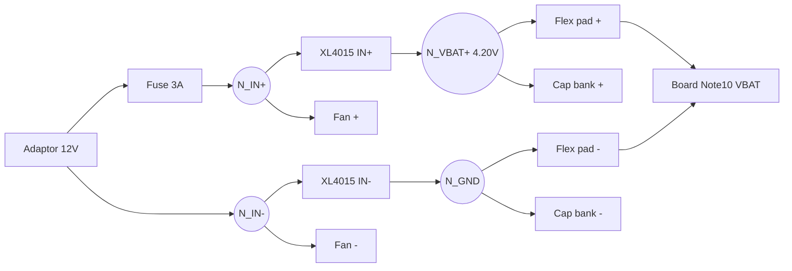

# DIAGRAM — skema & peta node

## Block diagram (versi tempel-dinding)

    ADAPTOR 12V(+) --[FUSE 3A]--+- N_IN+ --> XL4015 IN+
                                |          -> fan merah
    ADAPTOR 12V(-) -------------+- N_IN- --> XL4015 IN-
                                           -> fan hitam

    XL4015 OUT+ -- N_VBAT+ --> pad + flex --+--> cap bank (+)
    XL4015 OUT- -- N_GND   --> pad - flex --+--> cap bank (-)

    flex pin T -- [resistor NTC, nilai dari ukur sel bekas, opsional]

## Versi mermaid (render di GitHub/VSCode)

## Tabel node
| Node | Tegangan | Isi |
|---|---|---|
| N_IN+ | 12V | keluaran fuse, fan+, IN+ |
| N_IN- | 0V | fan-, IN- |
| N_VBAT+ | 4.20V | OUT+, pad + flex, cap+ |
| N_GND | 0V | OUT-, pad - flex, cap- |

## Tabel wiring
| Dari | Ke | Kabel | Catatan |
|---|---|---|---|
| Adaptor | fuse holder | bawaan adaptor + pigtail DC female | jangan potong kabel adaptor |
| fuse | IN+ modul | merah 20AWG pendek |  |
| IN-/OUT | sesuai node | hitam 20AWG |  |
| OUT | pad flex | bawaan modul 10cm | strain relief hot glue |
| cap bank | pad flex | bus wire <5cm | mepet konektor |

## Peta pin flex
| Pin | Fungsi | Status |
|---|---|---|
| + | VBAT+ | terwire |
| - | GND | terwire |
| T | NTC sensor | isi resistor sesuai ukur, hanya jika board minta |

## Catatan mekanis
- Blok cap bank <=2cm dari konektor; dibungkus glue/heat shrink biar elegan.
- Modul duduk di standoff/akrilik; sisi solder JANGAN nempel permukaan konduktif.
- Fan blower ke area SoC; exhaust diarahkan menyapu badan XL4015.
- Semua kabel dikunci strain relief di titik solder flex.

## Konvensi foto
photos/00-unboxing • 10-bench • 20-flex • 30-capbank • 40-integration •
50-boot • 99-final
